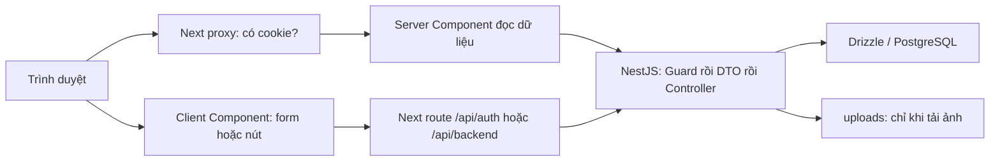
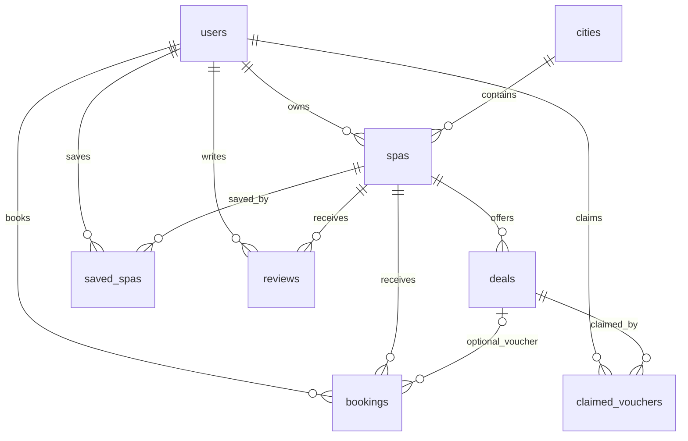

# Hướng dẫn học code và phân công nhóm 6 người

Bản học và demo đã chốt sau tối ưu ngày **25/09/2026**. Đọc cùng [cấu trúc dự án](PROJECT_STRUCTURE.md), [cách chạy](README.md) và [báo cáo kiểm tra](TEST_REPORT.md). Các lỗi đã tái hiện ở lần kiểm tra trước đã được sửa và kiểm tra hồi quy. Giao diện, logo, ba vai trò và trình tự demo được giữ nguyên.

## 1. Cách chia công việc

Chia theo **luồng tính năng từ giao diện → API → dữ liệu**, để ai cũng giải thích được cả frontend và backend của phần mình. Đây là phân công học và thuyết trình, không yêu cầu tách dự án thành sáu ứng dụng hoặc đổi kiến trúc.

| Người | Phần chính | Kết quả phải trình bày được | Thời lượng gợi ý |
|---|---|---|---|
| A | Tài khoản và phân quyền | Đăng ký, đăng nhập, đăng xuất; JWT/cookie; ba vai trò | 4–5 phút |
| B | Danh mục và giao diện | Trang chủ, chi tiết spa, tìm kiếm, thành phố, VI/EN, logo | 4–5 phút |
| C | Tương tác của khách | Lưu/bỏ lưu spa, đánh giá, đặt lịch thường, lịch sử | 4–5 phút |
| D | Voucher | Tạo/sửa/xóa, nhận, ví voucher, dùng một lần, hết hạn | 4–5 phút |
| E | Quản lý spa và ảnh | Tạo/sửa spa, quyền sở hữu, tải ảnh, lịch của owner, thống kê | 4–5 phút |
| F | Quản trị và vận hành | Duyệt/từ chối, khóa/mở khóa, khởi động hệ thống, chạy test | 4–5 phút |

## 2. Kiến thức cả nhóm cùng nắm

### Công nghệ thực sự được dùng

| Công nghệ | Vai trò trong dự án | Chỗ xem |
|---|---|---|
| TypeScript | Khai báo kiểu dữ liệu cho cả hai package | `pj-fe/src/lib/api.ts`, DTO backend |
| Next.js 16, React 19 | Route, dựng trang trên server, form tương tác trên browser | `pj-fe/src/app/`, `components/` |
| CSS, Tailwind 4/PostCSS | Tailwind được cấu hình; phần lớn giao diện hiện dùng class CSS tự viết | `globals.css`, `postcss.config.mjs` |
| NestJS 11 | Nhận HTTP request, kiểm tra quyền, xử lý nghiệp vụ | `pj-be/src/core/`, `main.ts` |
| class-validator / class-transformer | Kiểm tra body theo DTO qua `ValidationPipe` | DTO trong các file `core/` |
| PostgreSQL, Drizzle, pg | Lưu dữ liệu; viết truy vấn TypeScript; quản lý kết nối | `schema.ts`, `db.ts`, migration SQL |
| bcryptjs, jsonwebtoken | Băm mật khẩu và ký/xác thực JWT | `auth.ts` |
| Multer qua FileInterceptor | Nhận ảnh multipart; lưu file tại backend | `owner.ts::uploadImage` |
| Jest, ts-node, Node assert | Test DTO và chạy kiểm tra API thực tế | `validation.spec.ts`, `scripts/` |
| Swagger | Xem/thử các API tại `/api/docs` | `main.ts` và decorator API |

`React Query` và `Zustand` đã được bỏ vì không dùng. Form dùng React state; đọc dữ liệu bằng Server Component và fetch. Dự án hiện không có Redux, microservices, cổng thanh toán hay dịch vụ lưu ảnh đám mây.

### Sơ đồ request



**Hàm dùng chung:** `lib/api.ts::api` dành cho server, lấy cookie và xử lý 401/404. `lib/client-api.ts::requestJson` dành cho browser, gửi JSON hoặc FormData và gom thông báo lỗi. Không dùng lẫn hai hàm này.

**Đọc trang:** `page.tsx` gọi `api()` trong `lib/api.ts`; Next đọc cookie `session`, gắn `Authorization: Bearer ...`, gọi Nest và dựng HTML. `cache: 'no-store'` giúp đọc dữ liệu mới.

**Bấm nút/gửi form:** component có `'use client'` chạy trong trình duyệt; gửi request cùng miền tới Next `/api/backend/...`; Next lấy token trong cookie rồi chuyển request sang Nest. Thành công thì `router.refresh()` yêu cầu dựng lại dữ liệu trang. Form không tự ghi trực tiếp vào PostgreSQL.

**Thứ tự backend:** Guard kiểm tra đăng nhập/quyền → `ValidationPipe` kiểm tra body DTO → hàm controller kiểm tra nghiệp vụ → Drizzle truy vấn DB → JSON trả về. `proxy.ts` chỉ kiểm tra có cookie; `JwtAuthGuard` mới là nơi quyết định token và quyền có hợp lệ không.

### Từ điển ngắn

| Từ | Hiểu đơn giản |
|---|---|
| Route / endpoint | Địa chỉ và phương thức xử lý, ví dụ `POST /me/bookings` |
| Controller | Nơi nhận request và thực hiện nghiệp vụ; dự án nhỏ nên phần lớn logic nằm ngay tại đây |
| DTO | Danh sách trường đầu vào và điều kiện hợp lệ; kiểu TypeScript riêng không đủ kiểm tra dữ liệu HTTP |
| Guard | Người kiểm tra quyền trước khi cho vào controller |
| JOIN | Ghép các bảng, ví dụ lịch đặt với tên spa và tên khách |
| Transaction | Nhiều thay đổi cùng thành công hoặc cùng hủy; dùng khi đặt lịch với voucher |
| Khóa chính ghép | Hai giá trị cùng xác định một dòng, ví dụ `(user_id, deal_id)` |

### Bản đồ dữ liệu

Các quan hệ dưới đây là quan hệ nghiệp vụ. Xem SQL để biết ràng buộc vật lý; `schema.ts` đã mô tả khóa ngoại và khóa duy nhất cho các bảng tương tác; các CHECK/index và phần chuyển dữ liệu cũ vẫn đọc ở SQL. Không phải mọi quan hệ trong sơ đồ đều có khóa ngoại vật lý (ví dụ deals–spas trong migration tạo mới).



| Bảng | Dữ liệu chính | Người cần hiểu sâu |
|---|---|---|
| `users` | Điện thoại duy nhất, hash mật khẩu, `role`, `status` | A, F |
| `cities`, `spas` | Thành phố, tên/địa chỉ/ảnh, chủ sở hữu, trạng thái duyệt | B, E |
| `saved_spas` | Cặp user–spa; lưu nhiều lần không tạo bản trùng | C |
| `reviews` | Sao 1–5, nhận xét; mỗi user đánh giá một spa một lần | C |
| `bookings` | Khách, spa, thời gian, voucher tùy chọn, trạng thái | C, D, E |
| `deals` | Voucher, spa, giá, ảnh, hạn dùng, trạng thái duyệt | D, F |
| `claimed_vouchers` | Voucher đã nhận của user, `available/used`, thời điểm sử dụng | D |

`users.id`, `spas.id`, `reviews.id`, `bookings.id` là UUID. `deals.id` và `cities.id` là số. Không dùng lẫn hai kiểu. `ids.ts` nhận cả UUID dạng cũ trong dữ liệu demo; đây là lý do lỗi `spaId must be a UUID` trước đây đã được xử lý.

## 3. Người A — Tài khoản và phân quyền

**Tính năng:** đăng ký user/owner, đăng nhập bằng điện thoại, đăng xuất, chuyển trang theo vai trò; chặn người chưa đăng nhập, sai quyền, tài khoản bị khóa.

**Đọc code theo thứ tự:**

1. `pj-fe/src/app/login/page.tsx`, `register/page.tsx`, `register/owner/page.tsx`: gọi cùng `AuthForm` với các `mode`.
2. `pj-fe/src/components/AuthForm.tsx::submit`: lấy form, gửi request, hiện lỗi, chuyển `/vi`, `/owner` hoặc `/admin`.
3. `pj-fe/src/app/api/auth/[action]/route.ts`: chuyển request đến Nest, đặt/xóa cookie `session`.
4. `pj-be/src/core/auth.ts`: `RegisterDto`, `LoginDto`, `AuthService.register/login/me`, `JwtAuthGuard.canActivate`, `Public`, `Roles`.
5. `pj-fe/src/proxy.ts`, `src/lib/api.ts`, `components/LogoutButton.tsx`: kiểm tra cookie, chuyển token và đăng xuất. Header dùng lại `LogoutButton` với class/nhãn phù hợp.

**Điểm cần hiểu thêm:** `ids.ts` có `UuidPipe` và `PositiveIntPipe` kiểm tra tham số URL trước truy vấn. DTO vẫn kiểm tra body. Role lấy từ tài khoản hiện tại trong DB sau khi xác thực JWT.

**API và dữ liệu:** `POST auth/register`, `auth/register/owner`, `auth/login`; `GET auth/me`. Prefix backend chung là `/api/v1/`. FE dùng `POST /api/auth/logout` để xóa cookie. Bảng chính: `users`.

**Logic cần kể:** đăng ký → kiểm tra điện thoại/mật khẩu → hash bcrypt → lưu user → ký JWT 7 ngày → Next đặt cookie HttpOnly. Lần sau Guard xác thực chữ ký rồi đọc DB để kiểm tra tài khoản còn hoạt động; sau đó xét `@Roles`. Không có chức năng tự đăng ký admin. Mật khẩu tối thiểu 8 ký tự, hiện không bắt buộc đủ chữ hoa/số/ký tự đặc biệt.

**Demo:** đăng nhập sai mật khẩu; đăng nhập user thành công; thử vào `/admin` thấy chuyển về trang user; đăng xuất. Chuẩn bị thêm tài khoản mới để demo đăng ký nếu cần.

**Câu hỏi cần trả lời:** Cookie và JWT khác nhau thế nào? Vì sao ẩn nút admin vẫn chưa đủ bảo vệ API? Vì sao khóa tài khoản có tác dụng với token đã cấp? Đăng xuất hiện xóa cookie, có thu hồi mọi bản sao JWT không? (Không.)

## 4. Người B — Danh mục và giao diện

**Tính năng:** danh sách spa/voucher, chi tiết spa, tìm kiếm, lọc thành phố, đổi VI/EN, thẻ thông tin, header/footer và logo nhóm.

**Đọc code theo thứ tự:**

1. `pj-fe/src/app/[locale]/layout.tsx`: kiểm tra `vi/en`, lấy user và thành phố, dựng Header/Footer.
2. `pj-fe/src/app/[locale]/page.tsx::Home`: đọc query, tải danh sách song song, lọc từ khóa.
3. `pj-fe/src/components/Header.tsx::changeCity/switchLanguage`: đổi URL; `CatalogCards.tsx`, `Footer.tsx`: hiển thị.
4. `pj-fe/src/app/[locale]/spas/[id]/page.tsx`: lấy spa/review và chỉ voucher của spa qua `catalog/deals?spaId=...`; không tải tất cả voucher rồi lọc.
5. `pj-be/src/core/catalog.ts::cities/spas/spa/deals/deal`: JOIN và lọc nội dung được duyệt. Phần hết hạn voucher phối hợp D.
6. `pj-fe/src/app/globals.css`, `layout.tsx`, `public/assets/`: giao diện, metadata, hình ảnh. Logo: `public/assets/images/common/logo_x.png`.

**API:** `GET catalog/cities`, `catalog/spas?city=...`, `catalog/spas/:id`, `catalog/deals?city=...`, `catalog/deals/:id`. Catalog yêu cầu đăng nhập. Dữ liệu: `cities`, `spas`, `deals`, `reviews`, tên tác giả từ `users`.

**Logic cần kể:** chọn thành phố → URL `?city=ha-noi` → backend lọc qua JOIN với `cities`. Nhập từ khóa `q` → Next tải danh sách rồi `.filter()` trên server, không phải truy vấn tìm kiếm toàn văn trong PostgreSQL. Đổi ngôn ngữ thay tiền tố URL, code chọn nhãn/title tương ứng; không có dịch tự động. Hai ô danh mục đầu trang là liên kết đến vùng spa/voucher, không phải bộ lọc loại dịch vụ.

**Demo:** xem logo/trang chủ → lọc thành phố → tìm tên spa → mở chi tiết → chuyển EN. Ở màn hình từ 980px trở xuống, mở menu ☰ để dùng bộ lọc và đổi ngôn ngữ.

**Câu hỏi:** Server Component khác Client Component thế nào? Vì sao chỉ hiện `approved`? Vì sao lọc thành phố và tìm từ khóa nằm ở hai nơi? Spa đổi thành phố thì voucher được lọc theo đâu? (Theo thành phố hiện tại của spa.)

## 5. Người C — Lưu spa, đánh giá và đặt lịch

**Tính năng:** lưu/bỏ lưu yêu thích; đánh giá 1–5 sao; đặt lịch không dùng voucher; xem lịch và đánh giá tại `/me`.

**Đọc code theo thứ tự:**

1. `pj-fe/src/components/SpaActions.tsx::send/review/book`: form, dữ liệu gửi, thông báo, refresh.
2. `pj-be/src/core/member.ts`: `ReviewDto`, `BookingDto`, `approvedSpa`, `saved/save/unsave`, `review/myReviews`, `book/myBookings`.
3. `pj-be/src/core/ids.ts`: định dạng ID spa.
4. `pj-fe/src/app/me/page.tsx`: phần spa đã lưu, lịch đã đặt, đánh giá.
5. `pj-fe/src/components/MutationButton.tsx`: nút bỏ lưu; `src/app/api/backend/[...path]/route.ts`: chuyển request từ form.

**API:** `GET/POST/DELETE me/saved` (POST/DELETE có `/:spaId`), `GET/POST me/reviews`, `GET/POST me/bookings`. Chỉ role `user`. Bảng: `saved_spas`, `reviews`, `bookings`.

**Logic cần kể:** lưu spa dùng cặp khóa duy nhất và `onConflictDoNothing`. Đánh giá kiểm tra spa đã duyệt; INSERT dùng unique(user, spa) và onConflictDoNothing, trả lỗi rõ ràng nếu đã đánh giá, kể cả hai request cùng lúc. Đặt lịch chuyển giờ từ input sang ISO, backend kiểm tra thời điểm tương lai rồi lưu. Lịch trả về tên spa bằng JOIN; `LEFT JOIN deals` cho phép lịch không có voucher.

**Phối hợp D:** C giải thích đặt lịch thường và phần insert booking; D giải thích nhánh `dealId` cùng transaction dùng voucher. Không sửa cùng hàm `book` đồng thời.

**Demo:** chọn spa chưa được tài khoản này đánh giá → lưu → đặt lịch tương lai → đánh giá → mở `/me` → bỏ lưu. Thử đặt ngày quá khứ hoặc đánh giá lần hai để giải thích phản hồi từ chối.

**Câu hỏi:** Vì sao lưu hai lần không có hai dòng? Vì sao kiểm tra ngày ở backend dù input đã có trên UI? Vì sao cần LEFT JOIN? Đã có xác nhận/hủy lịch chưa? (Chưa, mọi lịch mới là `pending`.) Hiện review có đòi phải đặt lịch trước không? (Không.)

## 6. Người D — Vòng đời voucher

**Tính năng:** owner tạo/sửa/xóa voucher; user nhận voucher, xem ví, dùng một lần khi đặt lịch; ẩn voucher hết hạn. Upload ảnh do E giải thích; duyệt do F giải thích.

**Đọc code theo thứ tự:**

1. `pj-be/src/core/owner.ts`: `DealDto`, `EditDealDto`, `ownDeal`, `createDeal/listDeals/editDeal/deleteDeal`.
2. `pj-fe/src/components/OwnerForm.tsx`: gửi dữ liệu và upload; `OwnerFields.tsx::DealFields`: các ô nhập voucher; `app/owner/page.tsx`: khu vực voucher.
3. `pj-fe/src/app/[locale]/deals/[id]/page.tsx`: nút nhận và trạng thái đã nhận/đã dùng.
4. `pj-be/src/core/member.ts::claimVoucher/vouchers/book`: kiểm tra điều kiện, ghi nhận và sử dụng.
5. `pj-fe/src/app/me/page.tsx`: ví voucher; `SpaActions.tsx`: form đặt lịch với `dealId`.
6. `pj-be/src/core/catalog.ts::expireDeals`; `schema.ts`: `deals`, `claimedVouchers`, `bookings`.

**DTO tạo/sửa:** `EditSpaDto = PartialType(SpaDto)` cho phép bỏ qua trường không sửa; `EditDealDto` dùng thêm `OmitType` để không cho chuyển voucher sang spa khác. Quy tắc kiểm tra được kế thừa, không chép lại. Null chỉ được dùng ở trường tùy chọn hỗ trợ xóa.

**API:** `GET/POST owner/deals`, `PATCH/DELETE owner/deals/:id`; `GET me/vouchers`, `POST me/vouchers/:dealId`, `POST me/bookings` với `dealId`.

```text
Owner tạo/sửa → pending → Admin duyệt → approved
                                          ↓ quá hạn, khi đọc catalog
                                        expired

User nhận → claimed_vouchers.available
         → đặt lịch có dealId → transaction → used + booking.pending
```

**Logic quan trọng nhất:** trước khi đặt, backend kiểm tra voucher đúng spa, đã duyệt, chưa hết hạn. Trong một transaction, UPDATE chỉ dòng đúng user/deal và còn `available`; không cập nhật được thì từ chối. Sau đó INSERT booking. Insert lỗi thì UPDATE cũng rollback. Hai request đồng thời đã được kiểm tra: chỉ một đặt lịch thành công. Khóa ghép ngăn nhận cùng voucher hai lần.

**Demo:** tạo voucher → F duyệt → user bấm nhận → mở `/me` → đặt lịch từ trang voucher → kiểm tra “Đã dùng” và tên voucher trong lịch. Lặp lại đặt lịch bị từ chối. Dùng voucher mới cho mỗi buổi tập, vì voucher đã dùng không có nút đặt lại.

**Câu hỏi:** `deals` khác `claimed_vouchers` thế nào? Vì sao phải có transaction? Xóa voucher có lịch liên quan được không? (Không.) Giá/giảm giá có được tính vào thanh toán không? (Chỉ hiển thị, chưa có thanh toán.) Hạn dùng hiện kiểm tra lúc gửi yêu cầu hay lúc đến spa? (Lúc gửi yêu cầu.)

**Hạn dùng và ví:** `lib/date-time.ts` chuyển giờ địa phương ↔ ISO UTC; `DealFields` điền giờ sau khi browser mount để không phụ thuộc timezone server. Giá trị trống gửi `null` để xóa hạn; không gửi trường (`undefined`) nghĩa là giữ nguyên. Ví kiểm tra cả `spaApprovalStatus`, trạng thái voucher và hạn dùng trước khi hiện nút đặt lịch.

## 7. Người E — Quản lý spa và tải ảnh

**Tính năng:** owner quản lý spa của mình, chọn thành phố, sửa thông tin, tải ảnh bìa spa/voucher, xem lịch khách và thống kê của mình.

**Đọc code theo thứ tự:**

1. `pj-fe/src/app/owner/page.tsx`: kiểm tra role, tải spa/deal/booking/stats/cities.
2. `pj-fe/src/components/OwnerForm.tsx::submit/uploadCover`: đọc FormData, upload trước rồi gửi JSON; `OwnerFields.tsx::SpaFields`: các ô nhập spa.
3. `pj-be/src/core/owner.ts`: `SpaDto`, `EditSpaDto`, `ownSpa`, `createSpa/editSpa/listSpas`, `uploadImage`, `bookings`, `stats`.
4. `pj-be/src/main.ts`: phục vụ `/uploads`; `pj-fe/next.config.ts`: rewrite ảnh về backend.
5. `pj-fe/src/app/api/backend/[...path]/route.ts`: giữ body và Content-Type multipart khi chuyển tiếp.

**API:** `GET/POST owner/spas`, `PATCH owner/spas/:id`, `POST owner/images`, `GET owner/bookings`, `GET owner/stats`. Bảng: `spas`, `cities`; đọc `bookings`, `users`, `deals`. File ảnh nằm tại `pj-be/uploads/`; DB chỉ giữ đường dẫn.

**Logic cần kể:** role owner chỉ cho phép vào nhóm API; `ownSpa/ownDeal` kiểm tra thêm bản ghi có thuộc đúng người đó không. Tạo/sửa đưa spa về `pending`. Lấy lịch bằng JOIN rồi lọc `spas.ownerId`, tránh nhìn lịch của owner khác. Upload giới hạn 2 MB, kiểm tra MIME và chữ ký đầu file PNG/JPEG/WebP, đặt tên UUID để tránh trùng.

**Demo:** tạo spa với ảnh → thấy `pending` → F duyệt → B thấy spa và ảnh ngoài catalog → user đặt lịch → quay lại owner thấy tên/điện thoại khách. Sửa spa và giải thích vì sao cần duyệt lại.

**Câu hỏi:** Tại sao upload ảnh rồi mới gửi thông tin spa? File ảnh và đường dẫn khác nhau thế nào? Nếu upload thành công nhưng lưu spa lỗi thì sao? (Có thể còn ảnh không được dùng.) Có xóa spa hoặc xác nhận lịch chưa? (Chưa.)

## 8. Người F — Quản trị, database và kiểm thử

**Tính năng:** admin xem thống kê/tài khoản/nội dung; duyệt hoặc từ chối; khóa/mở khóa user/owner. Chuẩn bị môi trường và tổng hợp kết quả test do các thành viên thực hiện.

**Đọc code theo thứ tự:**

1. `pj-fe/src/app/admin/page.tsx`: các danh sách, nút duyệt/khóa; `MutationButton.tsx`: PATCH.
2. `pj-be/src/core/admin.ts`: `ApprovalDto`, `BanDto`, `spaApproval/dealApproval/ban/stats`.
3. `pj-be/src/main.ts`, `app.module.ts`, `core/db.ts`: khởi động, đăng ký controller/guard, kết nối DB.
4. `pj-be/src/core/setup.ts`, `drizzle/20260924_restructure.sql`: tạo/cập nhật schema, seed tài khoản. Từng người A–E giải thích các bảng mình phụ trách trong `schema.ts`.
5. `pj-be/src/core/validation.spec.ts`, `scripts/smoke.ts`, `scripts/audit.ts`: test DTO/ID, demo xuyên suốt và tình huống lỗi; `pj-fe/tests/helpers.test.ts`: test chuyển giờ và gửi request.
6. `.env.example`, `package.json` của hai package, [README](README.md): cách chạy và cấu hình.

**API:** `GET admin/users|spas|deals|stats`; `PATCH admin/spas/:id/approval`, `admin/deals/:id/approval`, `admin/users/:id/status`.

**Logic cần kể:** guard chỉ cho `admin`; DTO chỉ nhận trạng thái hợp lệ. Duyệt ghi `approvalStatus`, catalog quyết định hiển thị. Khóa ghi `users.status`; Guard đọc lại DB nên token cũ không tiếp tục truy cập. UI chỉ có nút duyệt/từ chối ở danh sách `pending`. Admin không được khóa tài khoản admin. Migration SQL có unique index giới hạn một admin.

**Demo:** duyệt spa/voucher do E/D vừa tạo → kiểm tra xuất hiện ngoài catalog → khóa một tài khoản thử, kiểm tra bị chặn → mở khóa → trình bày kết quả test và giới hạn nghiệp vụ. Không khóa tài khoản đang dùng để trình chiếu các phần khác.

**Câu hỏi:** Migration khác seed thế nào? Vì sao build thành công chưa chứng minh nghiệp vụ đúng? Smoke test khác test DTO? Vì sao cần cả smoke và audit? (Smoke kiểm tra luồng chính; audit kiểm tra quyền, dữ liệu sai và tình huống biên. Bản chốt đạt cả hai.)

## 9. Quy ước các file dùng chung

| File | Phạm vi mỗi người |
|---|---|
| `member.ts`, `SpaActions.tsx`, `/me/page.tsx` | C: yêu thích/review/booking thường; D: ví và nhánh dùng voucher |
| `owner.ts`, `OwnerForm.tsx`, `OwnerFields.tsx`, `/owner/page.tsx` | D: form/CRUD voucher; E: spa, upload, danh sách lịch, thống kê |
| `catalog.ts` | B: danh sách/chi tiết/lọc; D: điều kiện và cập nhật hết hạn |
| `schema.ts`, migration | Mỗi người giải thích bảng liên quan; F tổng hợp cách tạo DB |
| `MutationButton.tsx`, route proxy | A giải thích cookie/token; C/D/F giải thích lời gọi cụ thể của mình |

Nếu cùng sửa code, thống nhất người đang sửa file trước; phân công theo hàm/section, tránh hai người ghi đè nhau. Mỗi người nộp: một sơ đồ 5 bước, danh sách API/bảng, một ca thành công, một ca bị chặn và câu trả lời cho câu hỏi cuối phần.

## 10. Kịch bản trình diễn chung

Chuẩn bị ba profile trình duyệt khác nhau cho user/owner/admin. Ba tab trong cùng profile **dùng chung cookie**, đăng nhập tài khoản mới sẽ đổi tài khoản của cả ba tab.

| Bước | Người thao tác | Nội dung và điều phải chứng minh |
|---|---|---|
| 1 | A | Giới thiệu 3 vai trò; đăng nhập, giải thích cookie/JWT |
| 2 | E | Owner tạo spa và upload ảnh → trạng thái pending |
| 3 | F | Admin duyệt spa |
| 4 | B | User thấy spa, lọc/tìm kiếm, mở chi tiết, chỉ logo |
| 5 | C | Lưu spa, đánh giá, đặt một lịch thường, xem `/me` |
| 6 | D | Owner tạo voucher của spa → F duyệt → user nhận và đặt lịch với voucher |
| 7 | E + D | Owner thấy lịch/tên voucher; user thấy voucher đã dùng |
| 8 | F + A | Khóa/mở khóa tài khoản thử; tổng kết kết quả test và giới hạn |

Chọn giờ đặt trong tương lai, dùng spa/voucher hoặc user mới khi cần lặp demo review/claim. Có thể tạo voucher có hoặc không có hạn dùng; giờ hiển thị trong input là giờ địa phương, backend lưu timestamp UTC.

## 11. Những điều phải nói đúng khi bảo vệ

- Dự án đặt lịch và quản lý ưu đãi; chưa có thanh toán, trừ tiền hay tính hóa đơn.
- Voucher được đánh dấu đã dùng ngay khi tạo booking thành công; chưa có QR/code cho lễ tân xác nhận.
- Booking lưu `pending`; chưa có hoàn thành/hủy/duyệt lịch, chia khung giờ hay kiểm tra trùng lịch.
- Review hiện không bắt buộc đã sử dụng dịch vụ; mỗi user được một review mỗi spa.
- VI/EN chủ yếu ở catalog; trang quản lý/cá nhân và nhiều mô tả vẫn tiếng Việt.
- Không nói “đã test 100%” hoặc “không còn lỗi”. Nêu chính xác kết quả trong [TEST_REPORT.md](TEST_REPORT.md).

**Cách học:** với mỗi thao tác, tự trả lời “bấm ở đâu → hàm nào chạy → gọi URL nào → kiểm tra gì → đọc/ghi bảng nào → UI thay đổi ra sao”. Hiểu được chuỗi này hữu ích hơn học thuộc từng dòng.
