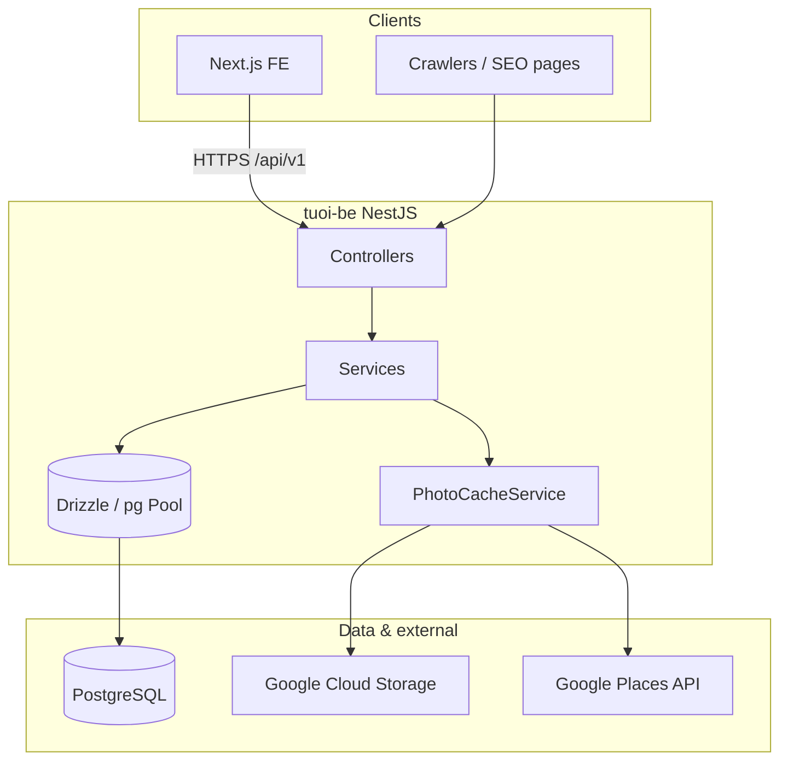

# 02 — Application Architecture

## High-level diagram



## Module responsibilities

| Module | Base path | Responsibility |
|--------|-----------|----------------|
| **locations** | `/locations` | Cities, districts, wards; **places** per district (paginated + `q` search) |
| **services** | `/services` | Service categories for filters |
| **deals** | `/deals` | Deal listing (grouped by spa), detail, filters; flash sale window |
| **spas** | `/spas` | Spa detail (deals, reviews, photos, opening hours); recommended list |
| **pages** | `/pages` | `GET /pages/resolve?url=` — full listing page payload (deals + filters + SEO) |
| **seo** | `/seo` | SEO URL export for sitemap generation |
| **home** | `/home` | Hero / promo banners |
| **tracking** | `/tracking` | View/click analytics |

**Internal (no direct HTTP):**

- **url-resolver** — resolves pathname + locale to `seo_nodes` / city / district / service / place IDs; used by `pages`.

## Data layer

- **Single global `DbModule`** — one `pg.Pool` per process; inject token `DRIZZLE`.
- **Pool settings** (`db.provider.ts`): `DB_POOL_MAX` (default 5), `connectionTimeoutMillis` 10s, `idleTimeoutMillis` 30s.
- **Schemas** under `src/db/schema/`: `spas`, `deals`, `deal_variants`, `spa_locations`, `seo_nodes`, `spa_galleries`, `spa_external_reviews`, etc.

**Important:** Cloud Run can scale to multiple instances; total DB connections ≈ `DB_POOL_MAX × running instances`. Size PostgreSQL `max_connections` accordingly.

## Photo pipeline (`PhotoCacheService`)

1. Spa may have `spa_avatar` and rows in `spa_galleries` (direct HTTPS URLs).
2. If gallery is empty, API falls back to `spas.photos` JSONB + `google_place_id` (fetch/cache via Places → GCS).
3. Private GCS objects are exposed via **V4 signed URLs**; TTL from `SIGNED_URL_TTL_SECONDS` (default 72h).

## Deal publication & flash sale

- Active deals filtered by `status = active` and **publication window** (`dealWithinPublicationWindow()` on `start_at` / `end_at`).
- **Flash sale** — short campaigns from `deal_time_slots` or deal `start_at`/`end_at` duration ≤ 120 minutes; shared window cached per process for `getDeals` + `getFlashSale`.

## Pages resolve flow (simplified)

1. `url-resolver` maps `url` + `locale` → page type, city, district, service, place.
2. Parallel loads: services, cities, flash window, districts, places (if needed).
3. `dealsService.getDeals()` with filters; optional region chip counts on page 1.
4. SEO meta from templates or hub builders.

Heavy on DB — optimizations include staggered queries and short-lived caches for flash window / categorized deal counts.

## Configuration (`app.module.ts`)

Validated with **Joi** at startup. Required: `DB_*`. Optional: `GOOGLE_MAPS_API_KEY`, `GCS_*`, `SIGNED_URL_TTL_SECONDS`, `DB_POOL_MAX`.

**Debug logging:**

- `API_PROFILE=1` — debug timings in deals/pages.
- `PHOTO_VERBOSE=1` — verbose PhotoCache logs.

## API documentation

With the server running:

```text
http://<host>:3000/api/docs
```

Use this for exact query params and DTO shapes when integrating the frontend.

Next: [03-environments-and-cicd.md](./03-environments-and-cicd.md)
