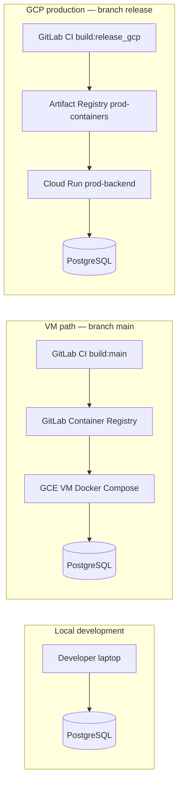

# 03 — Environments & CI/CD

## Environment map



| | **Local** | **VM (integration)** | **GCP production** |
|---|-----------|----------------------|---------------------|
| **Trigger branch** | — | `main` | `release` |
| **GitLab environment** | — | `production` (VM deploy job) | `production-gcp` |
| **Runtime** | `npm run start:dev` | Docker on GCE VM | Cloud Run managed |
| **Image registry** | — | GitLab project registry | `asia-southeast1-docker.pkg.dev/.../prod-be-api` |
| **Public URL** | `localhost:3000` | VM IP:3000 (or reverse proxy) | `https://api.glowexplore.com` (after domain mapping) |
| **Typical use** | Feature development | Pre-prod / legacy deploy | Live API |

> **Naming note:** GitLab labels the VM deploy environment `production`, but operationally many teams treat this host as **integration / staging**. GCP Cloud Run on `release` is the **customer-facing production** path.

There is **no separate Cloud Run staging service** in the current pipeline.

---

## GitLab CI overview

File: **`.gitlab-ci.yml`** at repo root (`tuoi-be`).

**Runner:** all jobs use tag **`vm-docker`** (self-hosted GitLab Runner on a GCE VM). Docker builds use the host daemon via:

```yaml
DOCKER_HOST: "unix:///var/run/docker.sock"
```

Runner setup example: `scripts/gitlab-runner-vm-docker.toml.example` (mount `/var/run/docker.sock`, user `gitlab-runner` in `docker` group).

### Stages

1. **build** — `docker build` + push image  
2. **deploy** — SSH to VM **or** `gcloud run deploy`

### Pipelines by branch

| Branch | Jobs | Result |
|--------|------|--------|
| **`main`** | `build:main` → `deploy:vm` | Image in GitLab Registry; container recreated on VM via `docker compose` in `~/app/` |
| **`release`** | `build:release_gcp` → `deploy:prod_gcp` | Image `prod-be-api:<sha>` in Artifact Registry; Cloud Run `prod-backend` updated |
| **Feature / MR** | *(none by default)* | Pipeline may show **0 jobs** — rules only match `main` and `release` |

To run CI on merge requests, extend `rules:` (e.g. `if: $CI_PIPELINE_SOURCE == "merge_request_event"`).

---

## VM path (branch `main`) — detailed flow

### 1. `build:main`

- Image: `docker:27`
- Tags: `$CI_REGISTRY_IMAGE:$CI_COMMIT_SHORT_SHA` and `:latest`
- Pushes to **GitLab Container Registry**

### 2. `deploy:vm`

- SSH to `$VM_USER@$VM_HOST` using `$SSH_PRIVATE_KEY` (base64 in CI variable)
- On VM:
  1. `docker login` to GitLab registry  
  2. `docker pull` new image  
  3. Write `~/app/.compose.env` with `DOCKER_IMAGE` and `IMAGE_TAG`  
  4. `docker compose --env-file ~/app/.compose.env -f ~/app/docker-compose.yml up -d --force-recreate`

**On the VM** (one-time / ops):

| Path | Purpose |
|------|---------|
| `~/app/docker-compose.yml` | Same as repo `docker-compose.yml` — maps port `3000`, `env_file: .env` |
| `~/app/.env` | **Not in git** — `DB_*`, API keys, etc. |
| `~/app/.compose.env` | Written by CI — image name + tag |

Compose file in repo:

```yaml
services:
  backend:
    image: ${DOCKER_IMAGE}:${IMAGE_TAG:-latest}
    ports:
      - "3000:3000"
    env_file:
      - .env
```

### Required GitLab CI/CD variables (`main` / VM)

| Variable | Description |
|----------|-------------|
| `CI_REGISTRY_USER` / `CI_REGISTRY_PASSWORD` | Usually provided by GitLab |
| `SSH_PRIVATE_KEY` | Base64-encoded private key for VM SSH |
| `VM_HOST` | VM public IP or hostname |
| `VM_USER` | SSH user (e.g. `ubuntu`) |

---

## GCP production path (branch `release`) — detailed flow

### 1. `build:release_gcp`

- Authenticates with GCP service account (`GCP_PROD_SA_KEY_B64`, `GCP_PROD_SA_KEY`, or `GCP_PROD_SA_KEY_FILE`)
- Builds and pushes:
  - `asia-southeast1-docker.pkg.dev/services-project-490810/prod-containers/prod-be-api:$CI_COMMIT_SHORT_SHA`
  - `:latest`

### 2. `deploy:prod_gcp`

- Reads `scripts/cloud-run-be-secrets.manifest` → builds `--set-secrets` for Cloud Run
- Deploys service **`prod-backend`**:
  - Region: `asia-southeast1`
  - Service account: `prod-be-runtime@services-project-490810.iam.gserviceaccount.com`
  - `--allow-unauthenticated` (public HTTP)
  - Env: `NODE_ENV=production`, `SIGNED_URL_TTL_SECONDS=259200`
  - Resources: 512Mi RAM, 1 CPU, min 0 / max 10 instances

### Required GitLab CI/CD variables (`release`)

| Variable | Notes |
|----------|--------|
| `GCP_PROD_SA_KEY_B64` | Base64 JSON key for `prod-be-cicd@...` (preferred) |
| Or `GCP_PROD_SA_KEY` / `GCP_PROD_SA_KEY_FILE` | Alternatives |

**Common failure:** *Missing GCP_PROD_SA_KEY* — check variable exists on **backend** project, **Protected** matches protected `release` branch, **Environment scope** is `*` or `production-gcp`.

---

## Branching & release process (recommended)

```text
feature/*  →  merge request  →  main     (VM deploy — integration test)
main       →  merge / tag    →  release  (GCP prod deploy)
```

1. Develop on feature branches; test locally or merge to `main` to exercise VM pipeline.  
2. When ready for production, merge `main` → `release` (or cherry-pick) and push `release`.  
3. Confirm pipeline `build:release_gcp` + `deploy:prod_gcp` succeed in GitLab.  
4. Smoke-test `https://api.glowexplore.com/api/v1/...` (after DNS is configured).

---

## Self-hosted GitLab Runner checklist

1. Install GitLab Runner on VM; register with **group runner** token (`glrt-...`) if project tokens are disabled.  
2. Tag runner: **`vm-docker`**.  
3. `config.toml`: mount `/var/run/docker.sock`; **do not** use `docker:dind` on this setup.  
4. `sudo usermod -aG docker gitlab-runner` && restart runner.  
5. Verify: `sudo gitlab-runner verify` — runner **online** in GitLab UI.

---

## Frontend CI (separate repo)

`tuoi-fe` uses the same GCP project and `prod-be-cicd` key pattern; deploys **`prod-frontend`** on branch `release`. See `frontend/specs/gcp-prod-frontend.md` in the monorepo if present.

Next: [04-production-gcp-and-cloudflare.md](./04-production-gcp-and-cloudflare.md)
