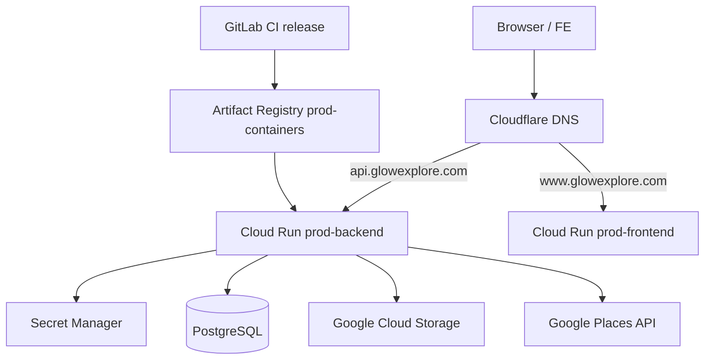

# 04 — Production: GCP, Database, Cloudflare

## Production topology



| GCP resource | Name | Role |
|--------------|------|------|
| **Project** | `services-project-490810` | All prod resources |
| **Region** | `asia-southeast1` | Cloud Run, Artifact Registry |
| **Artifact Registry** | `prod-containers` | Docker images `prod-be-api`, `prod-fe-web` |
| **Cloud Run** | `prod-backend` | NestJS API |
| **Cloud Run** | `prod-frontend` | Next.js (FE repo) |
| **Runtime SA (BE)** | `prod-be-runtime@services-project-490810.iam.gserviceaccount.com` | Access secrets, GCS at runtime |
| **CI/CD SA** | `prod-be-cicd@services-project-490810.iam.gserviceaccount.com` | Push images, deploy Cloud Run |

IAM bootstrap (run once by admin):

```bash
cd /path/to/tuoi-be
chmod +x scripts/gcp-prod-iam-grants.sh
./scripts/gcp-prod-iam-grants.sh
```

---

## Database architecture

### Model

- **Engine:** PostgreSQL  
- **Database name:** `agentspa` (typical)  
- **Access:** Application connects with `DB_HOST`, `DB_PORT`, `DB_NAME`, `DB_USER`, `DB_PASSWORD` — no ORM-level multi-tenancy.

**Current production pattern:** PostgreSQL runs on infrastructure **reachable from Cloud Run** (commonly a **GCE VM** with Postgres listening on a stable IP, or **Cloud SQL**). Connection details are **not** baked into the image; they come from **GCP Secret Manager** via the deploy manifest.

### Secrets → Cloud Run

File: `scripts/cloud-run-be-secrets.manifest`

```text
DB_HOST=prod-be-db-host:latest
DB_PORT=prod-be-db-port:latest
DB_NAME=prod-be-db-name:latest
DB_USER=prod-be-db-user:latest
DB_PASSWORD=prod-be-db-password:latest
GCS_BUCKET_NAME=prod-be-gcs-bucket-name:latest
GOOGLE_MAPS_API_KEY=prod-be-google-maps-api-key:latest
```

Each line maps **environment variable** → **secret-id:version**. The `deploy:prod_gcp` job reads this file and passes `--set-secrets` to `gcloud run deploy`.

**Adding a new secret:**

1. Create secret in Secret Manager (`gcloud secrets create ...`).  
2. Add line to `cloud-run-be-secrets.manifest`.  
3. Add secret id to `BE_SECRETS` in `scripts/gcp-prod-iam-grants.sh` and re-run grants.  
4. Deploy branch `release` again.

### Connection pooling & limits

- Each Cloud Run instance runs one Node process with a `pg` pool.  
- **`DB_POOL_MAX`** default **5** (set in app; prod also sets related env via secrets if needed).  
- **Rough max connections:** `DB_POOL_MAX × max Cloud Run instances` (e.g. 5 × 10 = **50**).  
- PostgreSQL must have `max_connections` above this total (include admin connections and other clients).  
- Error **`53300`** (*too many connections*) → reduce `DB_POOL_MAX`, lower `max-instances`, or increase DB `max_connections`.

### Optional: migrate to Cloud SQL

Script: `scripts/cloud-sql-vm-to-cloudsql.sh` — dumps from VM Postgres and restores to Cloud SQL. After migration, update Secret Manager `prod-be-db-host` (public IP, private IP via VPC, or `/cloudsql/CONNECTION_NAME` with Cloud SQL Auth Proxy / Cloud Run volume). See script output for suggested `DB_HOST` values.

**Firewall:** Cloud Run egress must be allowed to reach the DB host/port (authorized networks on Cloud SQL, or VM firewall rules for GCE-hosted Postgres).

---

## Cloud Run service (`prod-backend`)

| Setting | Value |
|---------|--------|
| Image | `.../prod-containers/prod-be-api:<git-sha>` |
| Port | `3000` (container listens on `PORT`) |
| Auth | Public (`--allow-unauthenticated`) |
| Scale | min 0, max 10 |
| Memory / CPU | 512Mi / 1 |

**Console:** [Cloud Run services](https://console.cloud.google.com/run?project=services-project-490810) → `prod-backend` → Revisions, Logs, Metrics.

**Default URL (before custom domain):**

```text
https://prod-backend-<hash>-as.a.run.app
```

Use this URL for smoke tests if DNS is not ready.

---

## Custom domain & Cloudflare

**Approach:** [Cloud Run domain mappings](https://cloud.google.com/run/docs/mapping-custom-domains) (Google-managed TLS) + DNS records at **Cloudflare**.

| Hostname | Cloud Run service |
|----------|-------------------|
| **`api.glowexplore.com`** | `prod-backend` |
| **`www.glowexplore.com`** (or apex) | `prod-frontend` |

### Prerequisites

1. Domain **`glowexplore.com`** uses **Cloudflare nameservers** at the registrar.  
2. Domain **verified** in GCP (`gcloud domains list-user-verified`).  
   - Usually: Google Search Console → **TXT** record on Cloudflare (`@` or host Google specifies).  
   - Do **not** confuse verification TXT with API routing A/CNAME records.

### Steps (API)

```bash
# 1. Beta component (once)
gcloud components install beta --quiet

# 2. Verify domain ownership
gcloud domains verify glowexplore.com --project=services-project-490810
gcloud domains list-user-verified --project=services-project-490810

# 3. Create mapping (from backend repo)
./scripts/gcp-prod-domain-mapping.sh create prod-backend api.glowexplore.com

# 4. Get DNS records to add in Cloudflare
./scripts/gcp-prod-domain-mapping.sh describe api.glowexplore.com
```

On **Cloudflare → DNS**:

- Add **A / AAAA / CNAME** exactly as `describe` outputs (name often `api` for `api.glowexplore.com`).  
- For API, start with **DNS only (grey cloud)** so Google-managed certificates provision reliably.  
- Wait for TLS (minutes to hours).

### Traffic path

```text
Client → Cloudflare DNS → Cloud Run domain mapping → prod-backend revision
```

**Frontend** must use public API base URL, e.g. `NEXT_PUBLIC_API=https://api.glowexplore.com` (exact env name depends on FE repo).

Backend enables **CORS** broadly in `main.ts` (`enableCors()`); tighten origins in production if required.

### Verify API

There is no dedicated `/health` route in the codebase. Use a lightweight read endpoint, for example:

```bash
curl -sS "https://api.glowexplore.com/api/v1/services" | head -c 200
curl -sS -o /dev/null -w "%{http_code}\n" "https://api.glowexplore.com/api/docs"
```

---

## GCS & Google Maps (production)

| Concern | Configuration |
|---------|----------------|
| **Maps** | `GOOGLE_MAPS_API_KEY` from Secret Manager — Places Photos / details for photo cache |
| **Storage** | `GCS_BUCKET_NAME` — spa images; runtime SA needs object read (+ write if caching uploads) |
| **Signed URLs** | `SIGNED_URL_TTL_SECONDS=259200` (72h) set in Cloud Run deploy env |
| **Legacy bucket** | Optional `GCS_LEGACY_SPA_IMAGES_BUCKET` for older crawled images |

Runtime permissions are granted by `gcp-prod-iam-grants.sh` (GCS bucket binding on `prod-be-runtime`).

---

## Security notes for handover

- **Never commit** `.env`, service account JSON, or SSH keys.  
- Rotate GitLab and GCP keys when team membership changes.  
- Restrict **VM SSH** and **Postgres** firewall to known IPs where possible.  
- Prefer **Secret Manager** over plain env on the VM for production credentials.  
- Review Cloud Run **IAM** if moving from public API to authenticated invoke.

**Deeper GCP steps (Vietnamese):** [`../../specs/gcp-prod.md`](../../specs/gcp-prod.md)

Next: [05-operations-runbook.md](./05-operations-runbook.md)
